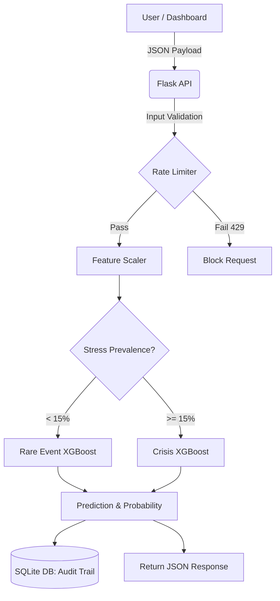

# 🏦 Bank Early Warning System (EWS)


An end-to-end Machine Learning system that predicts financial stress in Indian banks **12 months in advance** using RBI (Reserve Bank of India) data.

## Features

- **Dual-Model Architecture** — Automatically switches between Crisis and Rare Event models based on current stress prevalence
- **SHAP Explainability** — Full feature-level explanations for every prediction
- **Time-Based Backtesting** — Walk-forward validation across 2019–2025
- **Production REST API** — Flask API with SQLite audit trail, input validation, and rate limiting
- **Interactive Dashboard** — Predict stress for any bank in real time

## System Architecture



## Project Structure

```text
Bank_EWS_Project/
├── raw_data/           # 7 RBI Excel source files
├── cleaned_data/       # Intermediate cleaned CSVs
├── final_data/         # ML-ready dataset (1,462 rows × 16 cols)
├── notebooks/          # 5 Jupyter notebooks (pipeline)
│   ├── ML_Data_Cleaning.ipynb
│   ├── ML_Modeling.ipynb
│   ├── SHAP_Analysis.ipynb
│   ├── RareEvent_Optimization.ipynb
│   └── TimeBacktesting.ipynb
├── models/             # Serialized XGBoost models + scalers
├── flask_api/          # Production REST API
│   ├── app.py          # Flask application
│   ├── config.py       # Configuration
│   ├── models.py       # Database models
│   ├── dashboard.html  # Interactive dashboard
│   ├── tests/          # Pytest suite
│   └── requirements.txt
├── outputs/            # SHAP plots, backtest charts
└── docs/               # API documentation
```

## Prerequisites

Before installing the project, ensure you have the following installed on your machine:
- **Python 3.11** (Highly recommended for package compatibility)
- **Git** (For version control and cloning the repository)

## Quick Start

### 1. Setup

Clone the repository and set up your virtual environment:

```bash
git clone https://github.com/udaykumar-cs/bank-early-warning-system.git
cd bank-early-warning-system/flask_api
python -m venv venv
venv\Scripts\activate        # Windows
# source venv/bin/activate   # macOS/Linux
pip install -r requirements.txt
```

### 2. Configure Environment

Create a `.env` file in `flask_api/`:

```env
SECRET_KEY=your-random-secret-key-here
LOG_LEVEL=INFO
```

Generate a secure key using:
```bash
python -c "import secrets; print(secrets.token_hex(32))"
```

### 3. Run the API

```bash
python app.py
```

The API starts at `http://localhost:5000`. Visit `http://localhost:5000/dashboard` for the interactive UI.

## Running Tests

This project uses `pytest` for automated endpoint testing and input validation checking.

To run the test suite, ensure you are in the `flask_api` directory with your virtual environment activated, then run:

```bash
pytest tests/ -v
```

This will run tests for API endpoints, JSON structure, and mathematical bounds checks.

## API Endpoints

| Endpoint | Method | Description |
|----------|--------|-------------|
| `/` | GET | Service info + endpoint listing |
| `/dashboard` | GET | Interactive prediction dashboard |
| `/api/v1/health` | GET | Health check |
| `/api/v1/model/info` | GET | Model metadata & feature importance |
| `/api/v1/predict` | POST | Single bank prediction |
| `/api/v1/predict/batch` | POST | Batch prediction (up to 50 banks) |
| `/api/v1/predictions` | GET | Historical predictions (paginated) |
| `/api/v1/dashboard/stats` | GET | 7-day dashboard statistics |

### Example: Single Prediction

```bash
curl -X POST http://localhost:5000/api/v1/predict \
  -H "Content-Type: application/json" \
  -d '{
    "bank_name": "SBI",
    "year": 2024,
    "features": {
      "crar_total": 14.5,
      "npa_ratio": 9.5,
      "total_provisions": 5000,
      "net_profit": 1200,
      "interest_income": 15000,
      "interest_expense": 8000,
      "operating_expense": 4000,
      "credit_growth": 12.5,
      "repo_rate": 6.5,
      "inflation": 4.8
    }
  }'
```

See [docs/API_REFERENCE.md](docs/API_REFERENCE.md) for full documentation.

## Model Performance

| Year | AUC | Precision | Recall | F1 |
|------|-----|-----------|--------|----|
| 2019 | 0.950 | 0.769 | 0.938 | 0.845 |
| 2020 | 0.917 | 0.722 | 0.929 | 0.813 |
| 2021 | 0.938 | 0.769 | 0.909 | 0.833 |
| 2022 | 0.754 | 0.586 | 0.944 | 0.723 |

## 10 Input Features

| Feature | Description |
|---------|-------------|
| `crar_total` | Capital Adequacy Ratio (%) |
| `npa_ratio` | Non-Performing Assets Ratio (%) |
| `total_provisions` | Loan loss provisions (₹ Cr) |
| `net_profit` | Bank profitability (₹ Cr) |
| `interest_income` | Revenue from lending (₹ Cr) |
| `interest_expense` | Cost of deposits (₹ Cr) |
| `operating_expense` | Operational costs (₹ Cr) |
| `credit_growth` | Loan growth rate (%) |
| `repo_rate` | RBI policy rate (%) |
| `inflation` | CPI inflation (%) |

## Dual-Model Strategy

| Mode | Threshold | When Used |
|------|-----------|-----------|
| **Crisis** | 0.50 | Stress prevalence >= 15% |
| **Rare Event** | 0.85 | Stress prevalence < 15% |

## Troubleshooting

Here are 4 common issues and how to fix them:

**1. `RuntimeError: SECRET_KEY environment variable is not set.`**
* **Solution**: Ensure you have created a `.env` file in the `flask_api` folder and added `SECRET_KEY=your-key`.

**2. `No module named 'numpy._core'` or `scipy` errors during startup.**
* **Solution**: This is a dependency mismatch between numpy 1.x and 2.x. Run `pip install --upgrade numpy scipy scikit-learn` in your virtual environment.

**3. `422 Unprocessable Entity: Input validation failed`**
* **Solution**: You passed mathematically impossible data (e.g., negative NPA ratio or negative total provisions). Check your JSON payload.

**4. `503 Service Unavailable: Models not loaded`**
* **Solution**: Check `flask_api/config.py` to ensure `MODEL_CRISIS_PATH`, `MODEL_RARE_PATH`, and `SCALER_PATH` are pointing to the correct absolute paths on your machine.

## Contributing

We welcome contributions! Please follow these guidelines:
1. Fork the repository.
2. Create a new branch for your feature (`git checkout -b feature/AmazingFeature`).
3. Ensure all tests pass (`pytest tests/`).
4. Commit your changes (`git commit -m 'Add some AmazingFeature'`).
5. Push to the branch (`git push origin feature/AmazingFeature`).
6. Open a Pull Request.

## Tech Stack

- **ML**: XGBoost, scikit-learn, SHAP
- **API**: Flask, SQLAlchemy, SQLite, Flask-Limiter
- **Data**: pandas, numpy
- **Visualization**: matplotlib, seaborn
- **Testing**: pytest

## Author & Contact

**Uday Kumar**  
📧 Email: [kumaruday9973@gmail.com](mailto:kumaruday9973@gmail.com)  
🔗 GitHub: [udaykumar-cs](https://github.com/udaykumar-cs)  
🐛 Issues: [Report a Bug or Request a Feature](https://github.com/udaykumar-cs/bank-early-warning-system/issues)

## License

This project is for educational and research purposes.
